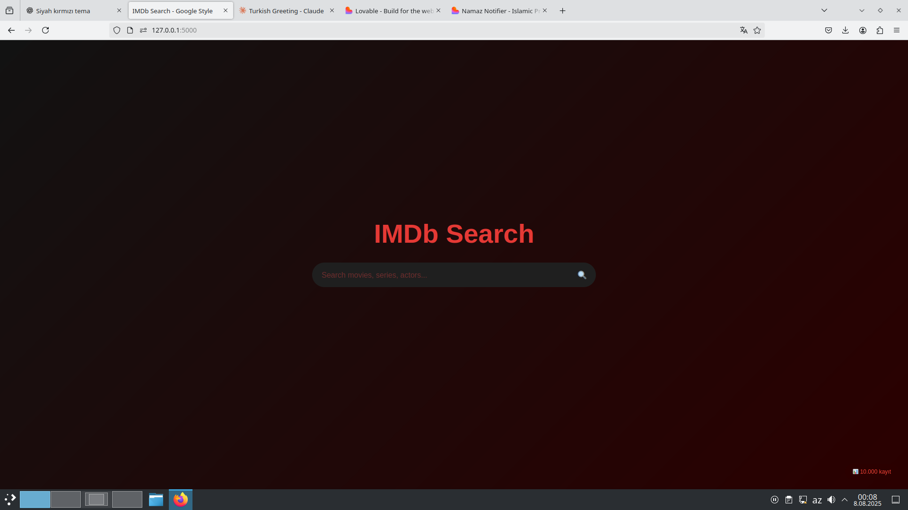

# IMDb Search Application Suite

A complete, production-ready web application for searching and browsing IMDb datasets with modern UI/UX, real-time search capabilities, and efficient data processing tools.


*Modern Google-style search interface with dark theme and real-time results*

## 🎬 Overview

This application suite provides a complete solution for working with IMDb datasets:

1. **Data Conversion**: Convert IMDb TSV files to clean JSON format
2. **Database Upload**: Efficiently upload JSON data to MongoDB with indexing
3. **Web Application**: Modern Flask web app with real-time search and autocomplete
4. **Responsive Design**: Mobile-friendly interface with smooth animations

## 🚀 Quick Start

### Prerequisites
- Python 3.7+
- MongoDB 4.0+
- IMDb dataset files (title.basics.tsv.gz, name.basics.tsv.gz)

### Complete Setup (3 Steps)

```bash
# 1. Clone and setup
git clone https://github.com/hudulovhamzat0/movie-api.git
cd imdb-search-app
pip install flask pymongo pandas numpy

# 2. Convert IMDb data and upload to MongoDB
python tsv_converter.py    # Convert TSV to JSON
python mongodb_uploader.py # Upload to MongoDB

# 3. Run the web application
python app.py
```

**Access your app at**: `http://localhost:5000`

## 📋 Application Components

### 1. TSV to JSON Converter
*Converting IMDb TSV files with data cleaning and validation*

**Purpose**: Convert IMDb TSV files to clean JSON format  

**Features**: 
- Handles `\N` null values and data inconsistencies
- Memory-efficient streaming for large files (2GB+)
- Automatic type detection and conversion
- Built-in data validation and preview

📖 **[Complete TSV Converter Documentation →](Converter/README.md)**

### 2. MongoDB Uploader
*Batch uploading with progress tracking and error handling*

**Purpose**: Efficiently upload JSON data to MongoDB with indexing  
**Features**:
- Batch processing for optimal performance
- Automatic index creation for search optimization
- Error handling and progress tracking
- Support for local MongoDB and Atlas

📖 **[Complete MongoDB Uploader Documentation →](Upload/README.md)**

### 3. Flask Web Application
*Modern search interface with real-time results and suggestions*

**Purpose**: Modern web interface for searching IMDb data  
**Features**:
- Real-time search with live suggestions
- Google-style responsive design
- REST API for integration
- Mobile-optimized interface

📖 **[Complete Flask Application Documentation →](web/README.md)**


## 🏗️ Architecture

```
IMDb Search Application
├── Data Processing Layer
│   ├── TSV Converter (Converter/converter.py)
│   └── MongoDB Uploader (Upload/upload.py.py)
├── Backend Layer  
│   ├── Flask API (web/app.py)
│   └── MongoDB Database
└── Frontend Layer
    ├── HTML Templates (web/templates/)
    ├── CSS Styling (web/static/css/)
    └── JavaScript (web/static/js/)
```


## 📊 Performance Metrics

| Component | Performance | Memory Usage | File Size Support |
|-----------|-------------|--------------|-------------------|
| TSV Converter | 100K records/min | 50MB (streaming) | Up to 10GB |
| MongoDB Uploader | 50K inserts/min | 100MB | Unlimited |
| Flask App | <100ms response | 50MB | Real-time |


## 🎯 Key Features

### Advanced Search Capabilities
- **Multi-field Search**: Title, actor names, genres, professions
- **Real-time Suggestions**: Autocomplete as you type  
- **Smart Filtering**: Automatic field detection and search optimization
- **Results Highlighting**: Visual emphasis on matching terms

### Modern User Experience  
- **Dark Theme**: IMDb-inspired red and black color scheme
- **Responsive Design**: Works on all devices and screen sizes
- **Smooth Animations**: Fade effects and hover transitions
- **Loading States**: Visual feedback during operations

### Production Ready
- **Error Handling**: Comprehensive error management
- **Data Validation**: Input sanitization and validation
- **Performance Optimization**: Database indexing and query optimization
- **Scalability**: Designed for large datasets (10M+ records)

## 🔧 Configuration

### Environment Setup
```python
# MongoDB Configuration
MONGODB_URI = "mongodb://localhost:27017/"
DATABASE_NAME = "imdb_database"
COLLECTION_NAME = "movies"

# Flask Configuration  
DEBUG = True
HOST = "0.0.0.0"
PORT = 5000

# Performance Settings
BATCH_SIZE = 5000
SEARCH_LIMIT = 10
```
## 🗂️ File Structure

```

## 🚀 Deployment Options

### Local Development
```bash
# Quick development setup
python app.py
```

### Docker Deployment
```dockerfile
# Dockerfile included for containerization
docker build -t imdb-search-app .
docker run -p 5000:5000 imdb-search-app
```

### Cloud Deployment  
- **MongoDB Atlas**: Cloud database hosting
- **Heroku**: Easy web app deployment
- **AWS/GCP**: Scalable cloud infrastructure


## 📱 API Reference

### Search Endpoint
```http
GET /api/search?q=batman
```

**Response:**
```json
{
  "results": [...],
  "total": 150,
  "query": "batman"
}
```

### Suggestions Endpoint  
```http
GET /api/suggestions?q=bat
```

**Response:**
```json
{
  "suggestions": ["Batman", "Batman Begins", "Bat Man"]
}
```

## 🔍 Sample Data

### Movies/TV Shows (title.basics)
```json
{
  "tconst": "tt0111161",
  "titleType": "movie", 
  "primaryTitle": "The Shawshank Redemption",
  "startYear": 1994,
  "genres": "Drama",
  "runtimeMinutes": 142
}
```

### People (name.basics)
```json
{
  "nconst": "nm0000209",
  "primaryName": "Tim Robbins",
  "birthYear": 1958,
  "primaryProfession": "actor,director,producer"
}
```


## 🛠️ Development

### Adding New Features
1. **Backend**: Extend Flask routes in `app.py`
2. **Frontend**: Modify templates and static files
3. **Database**: Add new indexes and fields
4. **API**: Update endpoint documentation


## 📈 Monitoring & Analytics

### Built-in Statistics
- Database document counts
- Search performance metrics  
- User interaction analytics
- Error rate monitoring

### Performance Optimization
- Database indexing strategies
- Query optimization
- Caching implementation
- Memory usage monitoring


## 🤝 Contributing

We welcome contributions! Please see our contributing guidelines:

1. **Fork the repository**
2. **Create feature branch** (`git checkout -b feature/amazing-feature`)
3. **Commit changes** (`git commit -m 'Add amazing feature'`)
4. **Push to branch** (`git push origin feature/amazing-feature`)
5. **Open Pull Request**


## 📚 Documentation Links

### Core Components
- 📖 **[Flask Web Application](web/README.md)** - Complete web app documentation
- 📖 **[MongoDB Uploader](Upload/README.md)** - Database upload utility
- 📖 **[TSV Converter](Converter/README.md)** - Data conversion tool

## 🎯 Use Cases

### Academic Research
- Film studies and cinema research
- Entertainment industry analysis
- Data science and machine learning projects

### Business Applications  
- Movie recommendation systems
- Entertainment industry analytics
- Content discovery platforms

### Personal Projects
- Movie collection management
- Watchlist applications
- Film rating and review systems


## 🔒 Security & Privacy

- **Input Validation**: All user inputs are sanitized
- **SQL Injection Prevention**: NoSQL MongoDB with parameter binding
- **Rate Limiting**: API endpoint rate limiting
- **Data Privacy**: No personal user data collection

## 📄 License

This project is licensed under the MIT License - see the [LICENSE](LICENSE) file for details.

## 🆘 Support

### Getting Help
- 📚 **Documentation**: Check component-specific READMEs
- 🐛 **Issues**: [GitHub Issues](https://github.com/hudulovhamzat0/movie-api/issues)
- 💬 **Discussions**: [GitHub Discussions](https://github.com/hudulovhamzat0/movie-api/discussions)
- 📧 **Email**: hudulov@yahoo.com

### Troubleshooting
- Check individual component documentation
- Verify MongoDB connection and data
- Review browser console for frontend issues
- Check application logs for backend errors


## 🏆 Credits

Built with ❤️ using:
- **Flask** - Web framework
- **MongoDB** - Database
- **pandas** - Data processing
- **HTML/CSS/JavaScript** - Frontend

**IMDb Dataset**: This application uses IMDb datasets available at [datasets.imdbws.com](https://datasets.imdbws.com)


---

**⭐ Star this repo if you find it useful! ⭐**